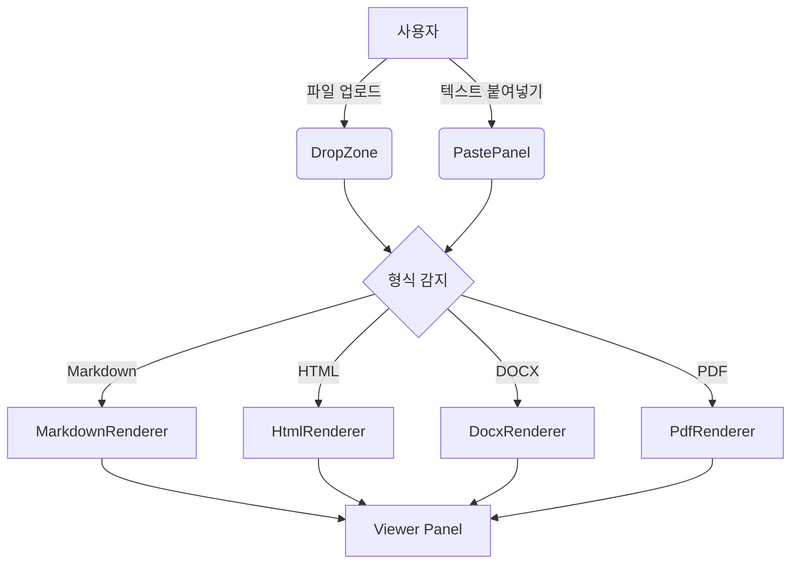

# Document Viewer 테스트 문서

## 소개

이 문서는 **Document Viewer**의 렌더링 기능을 테스트하기 위한 샘플입니다.

## 텍스트 서식

- **볼드** 텍스트
- *이탤릭* 텍스트
- ~~취소선~~ 텍스트
- `인라인 코드`

## 링크와 이미지

[GitHub](https://github.com) 링크 예시

## 코드 블록

```javascript
function fibonacci(n) {
  if (n <= 1) return n;
  return fibonacci(n - 1) + fibonacci(n - 2);
}

console.log(fibonacci(10)); // 55
```

```python
def hello(name: str) -> str:
    return f"Hello, {name}!"

print(hello("World"))
```

## Mermaid 다이어그램



## 표

| 형식     | 라이브러리    | 특징                    |
|----------|---------------|-------------------------|
| Markdown | marked.js     | GFM + Mermaid 지원      |
| HTML     | iframe        | JS 실행 차단 (sandbox)  |
| DOCX     | mammoth.js    | Word → HTML 변환        |
| PDF      | PDF.js        | Canvas 렌더링           |
| Text     | 내장          | 줄 번호 표시            |

## 인용

> "간결함은 지혜의 정수이다." — 셰익스피어

## 할 일 목록

- [x] 파일 업로드 구현
- [x] 텍스트 붙여넣기 구현
- [x] 형식 자동 감지
- [ ] PDF 가상 스크롤 최적화
